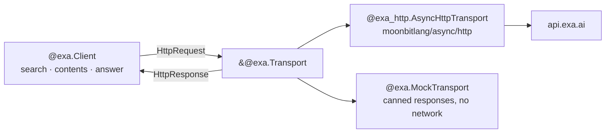

# marianoguerra/exa

A MoonBit client for the [Exa](https://exa.ai) search API: `/search`,
`/contents`, `/answer` and `/findSimilar`.

The library does not speak HTTP itself. It turns calls into request values and
hands them to a `Transport`, which means the core package builds on every
backend and your tests never touch the network. A transport backed by
`moonbitlang/async/http` ships alongside it.



## Install

```bash
moon add marianoguerra/exa
```

Add what you need to your `moon.pkg`:

```
import {
  "marianoguerra/exa",
  "marianoguerra/exa/async_http" @exa_http,
  "moonbitlang/async",
}
```

## Quick start

Every call is `async`, so it runs inside an event loop. `client_from_env` reads
your key from `EXA_API_KEY`.

```moonbit nocheck
///|
async fn main {
  let client = @exa_http.client_from_env()
  let response = client.search(
    "papers on retrieval-augmented generation",
    num_results=5,
    category=Publication,
    contents=@exa.ContentsOptions::new(highlights=On),
  )
  for result in response.results {
    println(result.title.unwrap_or("(untitled)"))
    println("  \{result.url}")
  }
}
```

`cmd/main` in this repository is a working version of that:

```bash
EXA_API_KEY=... moon run cmd/main --target native -- "your query"
```

## Calls

`Client::search` takes a natural-language query — Exa's index is
embedding-based, so a long description beats keywords — plus optional filters,
all as labelled arguments. Pass `contents` to get page text back with the
results instead of making a second call.

`Client::contents` fetches text, highlights or summaries for URLs you already
have. A URL that fails to crawl does not fail the call; it turns up in
`statuses` with an error tag.

`Client::answer` asks a question and returns prose plus the citations behind it,
or a structured object when you pass an `output_schema`.

`Client::find_similar` is there for existing code. Exa deprecated the endpoint —
use `search` with a query describing the source page.

Options that the API models as `boolean | object` are modelled as two cases, so
`text=On` sends `true` and `text=With(..)` sends the settings object:

```mbt check
///|
test "content options serialise the way the API expects" {
  let compact : Json = @exa.ContentsOptions::new(text=On, highlights=On).to_json()
  inspect(
    compact.stringify(),
    content=(
      #|{"text":true,"highlights":true}
    ),
  )
  let detailed : Json = @exa.ContentsOptions::new(
    text=With(@exa.TextOptions::new(max_characters=2000, verbosity=Full)),
    summary=With(@exa.SummaryOptions::new(query="what do they sell")),
    max_age_hours=0,
  ).to_json()
  inspect(
    detailed.stringify(),
    content=(
      #|{"text":{"maxCharacters":2000,"verbosity":"full"},"summary":{"query":"what do they sell"},"maxAgeHours":0}
    ),
  )
}
```

Arguments you leave out are left out of the request body entirely.

## Errors

A non-2xx response raises `ExaError::Api` carrying Exa's status, error tag,
message and request id. A 2xx body that will not decode raises
`ExaError::Decode`. Anything that stopped the request from getting there —
DNS, TLS, timeouts — propagates from the transport unchanged.

```moonbit nocheck
///|
let response = client.search(query) catch {
  @exa.Api(..) as error if error.is_rate_limited() => ... // back off and retry
  @exa.Api(status~, tag~, message~, request_id~) => ...
  @exa.Decode(message) => ...
}
```

`is_unauthorized`, `is_payment_required` and `is_rate_limited` save you from
hard-coding status numbers.

## Testing without a network

`MockTransport` answers from a script and records what it was asked to send, so
you can assert on both the request your code built and how it handled the
response. Because calls are async, drive them with the `%async.run` intrinsic:

```mbt check
///|
fn run_async(work : async () -> Unit noraise) -> Unit = "%async.run"

///|
fn[T] block_on(work : async () -> T) -> T raise {
  let outcome : Array[Result[T, Error]] = []
  run_async(async fn() noraise {
    outcome.push(Ok(work()) catch { error => Err(error) })
  })
  match outcome {
    [Ok(value)] => value
    [Err(error)] => raise error
    _ => abort("async work did not complete synchronously")
  }
}

///|
test "a search against a canned response" {
  let transport = @exa.MockTransport::json(
    (
      #|{
      #|  "requestId": "req-1",
      #|  "results": [{"url": "https://exa.ai", "title": "Exa"}],
      #|  "costDollars": {"total": 0.005}
      #|}
    ),
  )
  let client = @exa.Client::new(transport, "test-key")
  let response = block_on(async fn() {
    client.search("what is exa", num_results=1)
  })

  // what came back
  assert_eq(response.results[0].title, Some("Exa"))
  assert_eq(response.cost_dollars.unwrap().total, 0.005)

  // and what went out
  inspect(
    transport.last_body().unwrap().stringify(),
    content=(
      #|{"query":"what is exa","numResults":1}
    ),
  )
}

///|
test "an api error surfaces as ExaError::Api" {
  let transport = @exa.MockTransport::json(
    (
      #|{"requestId":"req-2","error":"Invalid API key","tag":"INVALID_API_KEY"}
    ),
    status=401,
  )
  let client = @exa.Client::new(transport, "wrong-key")
  let failed = try {
    let _ = block_on(async fn() { client.search("q") })
    false
  } catch {
    @exa.Api(..) as error => error.is_unauthorized()
    _ => false
  }
  assert_true(failed)
}
```

Every response type also keeps the JSON it decoded from in a `raw` field, so a
field Exa adds tomorrow is reachable today.

The response types can be built by hand, so code that renders them can be
tested without going through canned JSON. `new` takes the one required field
and leaves the rest optional:

```mbt check
///|
test "response values can be built with new" {
  let untitled = @exa.SearchResult::new("https://example.com")
  assert_eq(untitled.title, None)
  let titled = @exa.SearchResult::new("https://exa.ai", title="Exa")
  assert_eq(titled.title, Some("Exa"))
  assert_eq(titled.id, "https://exa.ai") // defaults to the url
  let response = @exa.SearchResponse::new(
    results=[titled, untitled],
    cost_dollars=@exa.CostDollars::new(0.005),
  )
  assert_eq(response.results[1].title, None)
}
```

The shapes are also public, so a struct literal works where you want every
field spelled out — MoonBit needs all of them, and `..` spreads from an
existing value:

```mbt check
///|
test "response values can be built as literals" {
  let result : @exa.SearchResult = {
    url: "https://exa.ai",
    id: "https://exa.ai",
    title: Some("Exa"),
    published_date: None,
    author: None,
    image: None,
    favicon: None,
    text: None,
    summary: None,
    highlights: [],
    highlight_scores: [],
    subpages: [],
    extras: None,
    raw: Json::null(),
  }
  assert_eq(result, @exa.SearchResult::new("https://exa.ai", title="Exa"))
  assert_eq({ ..result, title: None, }.title, None)
}
```

Because the shapes are public, adding a field to a response type breaks such
literals — new fields land in a minor version, not a patch. Calls to `new` are
unaffected, since a new field becomes a new optional argument.

## Backends

The core package builds everywhere. `marianoguerra/exa/async_http` follows
`moonbitlang/async/http`: native, JS and wasm, but not wasm-gc. On wasm-gc, or
in a browser, implement `@exa.Transport` over whatever HTTP you have.

## Not covered yet

Server-sent event streaming (`stream: true` on `/search` and `/answer`), and the
Websets, agent run, monitor, batch and team-management endpoints.

## License

Apache-2.0
